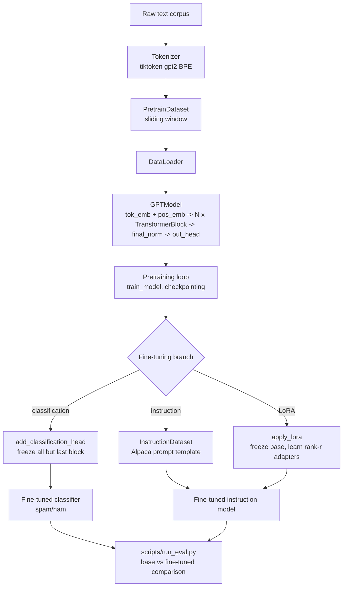

# loom

Personal capstone project: a GPT-2-style decoder-only transformer built from scratch,
organized as a clean, reusable personal reference project rather than a research
codebase.

Covers the full arc from raw text to a deployable fine-tuned model:
- **Ch1-4**: text pipeline, self/causal/multi-head attention, GPT architecture
- **Ch5**: pretraining loop, checkpointing, loading OpenAI's pretrained GPT-2 weights
- **Ch6**: classification fine-tuning (spam detection)
- **Ch7**: instruction fine-tuning + LoRA (parameter-efficient fine-tuning)

## Architecture / data flow



Also loadable directly from pretrained OpenAI GPT-2 weights (`loom/model/pretrained.py`),
skipping the pretraining loop entirely — this is the practical path used for Ch6/Ch7.

## Environment

- WSL2 Ubuntu 26.04 (Windows 11 Legion host — Windows only supplies the NVIDIA driver)
- Project lives entirely on Linux filesystem: `~/projects/loom` (never under `/mnt/c` —
  cross-filesystem I/O in WSL is slow)
- CPU: Intel Core Ultra 7 255HX | RAM: 32 GB
- GPU: RTX 5060 Laptop, 8GB VRAM, Blackwell / sm_120
- Python 3.12.13 (via `uv`, not apt — deadsnakes PPA has no builds yet for Ubuntu 26.04)
- torch 2.11.0+cu128 — verified `torch.cuda.is_available()` True, capability `(12, 0)`

Recreate env:
```bash
curl -LsSf https://astral.sh/uv/install.sh | sh
uv python install 3.12
cd ~/projects/loom && uv venv --python 3.12 .venv
source .venv/bin/activate
uv pip install torch --index-url https://download.pytorch.org/whl/cu128
uv pip install -r requirements.txt
```

## Structure

```
loom/
├── config.py                    # single source of truth: GPTConfig/TrainConfig/LoRAConfig + size presets
├── README.md / CLAUDE.md / CHANGELOG.md / LICENSE
├── data/
│   ├── raw/the-verdict.txt              # Ch1-5 pretrain smoke-test corpus (public domain)
│   ├── raw/sms_spam/SMSSpamCollection   # Ch6 classification dataset
│   └── raw/instruction/instruction-data.json  # Ch7 instruction dataset (Alpaca format)
├── loom/
│   ├── tokenizer/           # tiktoken gpt2 BPE wrapper
│   ├── dataset/             # sliding-window dataset + dataloader factory
│   ├── model/
│   │   ├── attention.py         # SelfAttention -> CausalAttention -> MultiHeadAttention (incremental)
│   │   ├── transformer_block.py # LayerNorm, GELU, FeedForward, TransformerBlock
│   │   ├── gpt.py               # full GPTModel
│   │   └── pretrained.py        # load OpenAI GPT-2 weights into our architecture
│   ├── train/
│   │   ├── pretrain.py       # training loop: grad clipping, periodic eval + sample generation
│   │   └── checkpoint.py     # save/load/resume
│   ├── finetune/
│   │   ├── classifier.py     # spam/ham classification head + training loop
│   │   ├── instruction.py    # Alpaca-style instruction fine-tuning
│   │   └── lora.py           # LoRA: low-rank adapters on attention q/k/v projections + merge_lora()
│   ├── eval/metrics.py       # loss calc, greedy/top-k/temperature generation
│   └── utils/seed.py         # reproducibility
├── scripts/
│   ├── run_pretrain.py               # DONE — from-scratch pretraining CLI
│   ├── run_finetune_classifier.py    # DONE — spam/ham classification CLI
│   ├── run_finetune_instruction.py   # DONE — Alpaca instruction fine-tune CLI
│   ├── run_lora.py                   # DONE — LoRA instruction fine-tune CLI (merges before saving)
│   ├── run_eval.py                   # DONE — base vs fine-tuned comparison
│   ├── _save_vanilla_gpt2.py         # DONE — one-off: saves real GPT-2 weights as a checkpoint (no training)
│   └── _train_lora_instruct.py       # DONE — one-off: LoRA + instruction fine-tune combined
├── hub_export/                # HF Hub publishing pipeline (see "Publishing" section below)
│   ├── configuration_loom.py / modeling_loom.py   # self-contained HF wrapper
│   ├── export_to_hub.py                           # checkpoint -> HF model, parity-checked
│   ├── MODEL_CARD_vanilla.md / MODEL_CARD.md / MODEL_CARD_lora.md  # per-variant model cards
│   └── export/                # gitignored — local save-before-push staging dir
├── checkpoints/              # gitignored — model weight dumps (smoketest/, vanilla_gpt2/,
│                              # instruction_ft/, lora_instruct/)
└── notebooks/                # optional scratch exploration
```

## How each stage connects

1. **Tokenizer -> Dataset -> DataLoader**: raw text becomes `(input, target)` token-id
   pairs via a sliding window, batched.
2. **GPTModel**: config-driven — same class instantiates 124M/355M/774M/1558M sizes,
   or the `_PRETRAINED` variants (context_length=1024, qkv_bias=True) needed to load
   real GPT-2 weights.
3. **Pretraining** (`train/pretrain.py`) trains from scratch on your own corpus, OR
   **`model/pretrained.py`** skips straight to loading OpenAI's trained weights —
   the practical starting point for fine-tuning experiments.
4. **Fine-tuning branches** all start from the same loaded model:
   - `finetune/classifier.py`: swaps `out_head` for a 2-class head, freezes everything
     except the last transformer block (cheap, fast convergence)
   - `finetune/instruction.py`: keeps the LM head, trains on Alpaca-formatted
     instruction/response pairs with loss masked on padding tokens
   - `finetune/lora.py`: freezes the entire base model, injects small rank-r adapters
     into attention q/v projections — 24x fewer trainable params than the classifier's
     last-block approach, in this repo's measurement (7.09M -> 296K)
5. **`scripts/run_eval.py`**: loads base model + an optional fine-tuned checkpoint,
   runs the same prompts through both side by side.

## Running each stage

```bash
# from repo root, with .venv activated:
export PYTHONPATH=.   # needed until an editable install (pyproject.toml) is added

# from-scratch pretraining (toy corpus by default — see --corpus to point elsewhere)
python scripts/run_pretrain.py --num-epochs 1 --checkpoint-dir checkpoints/pretrain

# spam/ham classification fine-tune
python scripts/run_finetune_classifier.py --num-epochs 1 --checkpoint-dir checkpoints/classifier

# Alpaca instruction fine-tune (full last-block)
python scripts/run_finetune_instruction.py --num-epochs 1 --checkpoint-dir checkpoints/instruction_ft

# Alpaca instruction fine-tune, LoRA (merges adapters into base weights before saving)
python scripts/run_lora.py --num-epochs 1 --checkpoint-dir checkpoints/lora_instruct

# base vs fine-tuned comparison
python scripts/run_eval.py --checkpoint checkpoints/my_run/checkpoint.pt
```

All four training CLIs accept `--help` for full flag lists (learning rate, batch size,
epochs, data path, etc. — see each script's `argparse` block for defaults).

## Onboarding walkthrough (new to this repo — start here)

Run these in order, from repo root with `.venv` activated and `PYTHONPATH=.` exported.
Each step is self-contained and prints something you can sanity-check before moving on.

**1. Confirm environment works**
```bash
python -c "import torch; print(torch.cuda.is_available(), torch.cuda.get_device_name(0))"
# expect: True <your GPU name>
```

**2. Tokenizer** — text to token IDs and back
```bash
python -c "
from loom.tokenizer import Tokenizer
t = Tokenizer()
ids = t.encode('Hello, world!')
print(ids, '->', t.decode(ids))
"
```

**3. Dataset + DataLoader** — sliding-window batches from raw text
```bash
python -c "
from loom.dataset.dataloader import create_pretrain_dataloader
text = open('data/raw/the-verdict.txt').read()
dl = create_pretrain_dataloader(text, context_length=8, batch_size=4)
x, y = next(iter(dl))
print('input batch:', x.shape, 'target batch:', y.shape)
"
```

**4. Attention building blocks** — self -> causal -> multi-head, in isolation
```bash
python -c "
import torch
from loom.model.attention import SelfAttention, CausalAttention, MultiHeadAttention
x = torch.rand(2, 6, 16)
print(SelfAttention(16, 16)(x).shape)
print(CausalAttention(16, 16, context_length=6, dropout=0.0)(x).shape)
print(MultiHeadAttention(16, 16, context_length=6, dropout=0.0, num_heads=4)(x).shape)
"
```

**5. Full GPT model** — forward pass, dummy input
```bash
python -c "
import torch
from config import GPT_CONFIG_124M
from loom.model.gpt import GPTModel
model = GPTModel(GPT_CONFIG_124M)
batch = torch.randint(0, GPT_CONFIG_124M.vocab_size, (2, GPT_CONFIG_124M.context_length))
print(model(batch).shape)  # expect [2, context_length, vocab_size]
"
```

**6. Pretraining loop** — trains from scratch on the-verdict.txt, saves a checkpoint
```bash
python -c "
import torch
from config import GPT_CONFIG_124M, TrainConfig
from loom.dataset.dataloader import create_pretrain_dataloader
from loom.model.gpt import GPTModel
from loom.train.pretrain import train_model

text = open('data/raw/the-verdict.txt').read()
split = int(0.9 * len(text))
train_loader = create_pretrain_dataloader(text[:split], context_length=256, batch_size=2)
val_loader = create_pretrain_dataloader(text[split:], context_length=256, batch_size=2)

device = 'cuda' if torch.cuda.is_available() else 'cpu'
model = GPTModel(GPT_CONFIG_124M).to(device)
optimizer = torch.optim.AdamW(model.parameters(), lr=5e-4)
train_cfg = TrainConfig(num_epochs=1, eval_freq=5, eval_iter=2, checkpoint_dir='checkpoints/demo')
train_model(model, train_loader, val_loader, optimizer, device, train_cfg, GPT_CONFIG_124M)
"
# expect: loss printed every 5 steps, one generated sample, checkpoint saved to checkpoints/demo/
```

**7. Load real pretrained GPT-2 weights** — skip training, use OpenAI's weights directly
```bash
python -c "
import torch
from config import GPT_CONFIG_124M_PRETRAINED
from loom.model.pretrained import load_pretrained_gpt2
from loom.eval.metrics import generate_text
from loom.tokenizer import Tokenizer

cfg = GPT_CONFIG_124M_PRETRAINED
model = load_pretrained_gpt2(cfg, 'gpt2-small (124M)')
device = 'cuda' if torch.cuda.is_available() else 'cpu'
model.to(device).eval()
tok = Tokenizer()
ids = torch.tensor(tok.encode('Every effort moves you')).unsqueeze(0).to(device)
out = generate_text(model, ids, max_new_tokens=25, context_length=cfg.context_length)
print(tok.decode(out.squeeze(0).tolist()))
"
# first run downloads ~500MB from HF hub, cached after that
```

**8. Classification fine-tuning** — spam/ham on top of pretrained GPT-2

Uses `loom/finetune/classifier.py`: `SpamDataset` loads
`data/raw/sms_spam/SMSSpamCollection`, `add_classification_head` swaps `out_head` for a
2-class head and freezes everything except the last transformer block + head,
`train_classifier` runs the loop.

```bash
python -c "
import pandas as pd
import torch
from torch.utils.data import DataLoader

from config import GPT_CONFIG_124M_PRETRAINED
from loom.model.pretrained import load_pretrained_gpt2
from loom.tokenizer import Tokenizer
from loom.finetune.classifier import SpamDataset, add_classification_head, train_classifier

# balance ham/spam (dataset is ~87% ham) and split train/val
df = pd.read_csv('data/raw/sms_spam/SMSSpamCollection', sep='\t', header=None, names=['label','text'])
spam = df[df.label=='spam']
ham = df[df.label=='ham'].sample(len(spam), random_state=123)
balanced = pd.concat([spam, ham]).sample(frac=1, random_state=123).reset_index(drop=True)
n = len(balanced)
balanced[:int(0.8*n)].to_csv('/tmp/train.tsv', sep='\t', header=False, index=False)
balanced[int(0.8*n):].to_csv('/tmp/val.tsv', sep='\t', header=False, index=False)

tok = Tokenizer()
train_loader = DataLoader(SpamDataset('/tmp/train.tsv', tok, max_length=64), batch_size=8, shuffle=True)
val_loader = DataLoader(SpamDataset('/tmp/val.tsv', tok, max_length=64), batch_size=8, shuffle=False)

device = 'cuda' if torch.cuda.is_available() else 'cpu'
cfg = GPT_CONFIG_124M_PRETRAINED
model = load_pretrained_gpt2(cfg, 'gpt2-small (124M)')
model = add_classification_head(model, emb_dim=cfg.emb_dim, num_classes=2)
model.to(device)

optimizer = torch.optim.AdamW(filter(lambda p: p.requires_grad, model.parameters()), lr=5e-5)
train_classifier(model, train_loader, val_loader, optimizer, device, num_epochs=1)
"
# expect: epoch 1: train acc ~0.85, val acc ~0.86
```

**9. Instruction fine-tuning** — Alpaca-format instruction following

Uses `loom/finetune/instruction.py`: `InstructionDataset` loads
`data/raw/instruction/instruction-data.json`, `instruction_collate_fn` pads each batch
and masks loss on padding tokens (`ignore_index=-100`), `train_instruction_model` runs
the loop.

```bash
python -c "
import functools
import torch
from torch.utils.data import DataLoader

from config import GPT_CONFIG_124M_PRETRAINED
from loom.model.pretrained import load_pretrained_gpt2
from loom.tokenizer import Tokenizer
from loom.finetune.instruction import InstructionDataset, instruction_collate_fn, train_instruction_model

tok = Tokenizer()
ds = InstructionDataset('data/raw/instruction/instruction-data.json', tok)
n = len(ds)
train_ds = torch.utils.data.Subset(ds, range(int(0.85*n)))
val_ds = torch.utils.data.Subset(ds, range(int(0.85*n), int(0.95*n)))

collate = functools.partial(instruction_collate_fn, max_length=256)
train_loader = DataLoader(train_ds, batch_size=4, shuffle=True, collate_fn=collate)
val_loader = DataLoader(val_ds, batch_size=4, shuffle=False, collate_fn=collate)

device = 'cuda' if torch.cuda.is_available() else 'cpu'
cfg = GPT_CONFIG_124M_PRETRAINED
model = load_pretrained_gpt2(cfg, 'gpt2-small (124M)').to(device)

optimizer = torch.optim.AdamW(model.parameters(), lr=5e-5)
train_instruction_model(model, train_loader, val_loader, optimizer, device, num_epochs=1)
"
# expect: train loss ~1.05 -> ~0.81 after 1 epoch
```

**10. LoRA** — parameter-efficient alternative to full fine-tuning

Uses `loom/finetune/lora.py`: `apply_lora(model, LoRAConfig())` freezes the entire base
model and injects small trainable rank-r adapters into attention q/v projections only.
Drop this call in right after loading the model, before building the optimizer — works
with either fine-tuning loop above.

```bash
python -c "
import torch
from config import GPT_CONFIG_124M_PRETRAINED, LoRAConfig
from loom.model.pretrained import load_pretrained_gpt2
from loom.finetune.classifier import add_classification_head
from loom.finetune.lora import apply_lora

device = 'cuda' if torch.cuda.is_available() else 'cpu'
cfg = GPT_CONFIG_124M_PRETRAINED
model = load_pretrained_gpt2(cfg, 'gpt2-small (124M)')
model = add_classification_head(model, emb_dim=cfg.emb_dim, num_classes=2)

lora_cfg = LoRAConfig(rank=8, alpha=16)
model = apply_lora(model, lora_cfg)
for p in model.out_head.parameters():
    p.requires_grad = True  # classification head still needs to train
model.to(device)

trainable = sum(p.numel() for p in model.parameters() if p.requires_grad)
total = sum(p.numel() for p in model.parameters())
print(f'trainable: {trainable:,} / {total:,}')
# then wire train_loader/val_loader/optimizer exactly like step 8
"
# expect: trainable params ~24x fewer than the full last-block fine-tune in step 8
# (296K vs 7.09M, measured on this repo — see Hardware notes below)
```

**11. Compare base vs fine-tuned**
```bash
python scripts/run_eval.py --checkpoint checkpoints/demo/checkpoint.pt
```

## Publishing to Hugging Face Hub

Checkpoints are exported as standalone, citable HF Hub models — see `hub_export/` for
the full pipeline:

- `hub_export/configuration_loom.py` / `modeling_loom.py` — self-contained HF
  `PreTrainedModel`/`PretrainedConfig` wrapper (inlines the architecture rather than
  importing `loom/model/`, since the Hub repo only ships its own files)
- `hub_export/export_to_hub.py` — loads a training checkpoint, builds the HF wrapper,
  runs a numeric parity check (max logit diff must be < 1e-4) before saving/pushing
- `hub_export/MODEL_CARD.md` — instruction-tuned variant's model card
- `hub_export/MODEL_CARD_vanilla.md` — vanilla (zero fine-tune) variant's model card

Two variants pushed so far, both as separate Hub repos under the `loom` family naming
convention (`loom-gpt2-124m[-variant]`):

**Vanilla** — real OpenAI GPT-2 small weights loaded, zero fine-tuning. No checkpoint
existed for this on disk initially (`checkpoints/smoketest/checkpoint.pt` was a
from-scratch toy-data demo run, not meaningful weights) — generated one first:
```bash
cd ~/projects/loom
PYTHONPATH=. python scripts/_save_vanilla_gpt2.py
# loads GPT_CONFIG_124M_PRETRAINED via load_pretrained_gpt2(), saves to
# checkpoints/vanilla_gpt2/checkpoint.pt
```
Then exported + pushed:
```bash
cd hub_export && PYTHONPATH=..:. python export_to_hub.py \
  --checkpoint ../checkpoints/vanilla_gpt2/checkpoint.pt --repo-id msclaw/loom-gpt2-124m --push
hf upload msclaw/loom-gpt2-124m MODEL_CARD_vanilla.md README.md
hf upload msclaw/loom-gpt2-124m configuration_loom.py configuration_loom.py
hf upload msclaw/loom-gpt2-124m modeling_loom.py modeling_loom.py
```

**Instruction-tuned** — Alpaca-format fine-tune on top of the same base:
```bash
cd hub_export && PYTHONPATH=..:. python export_to_hub.py \
  --checkpoint ../checkpoints/instruction_ft/checkpoint.pt --repo-id msclaw/loom-gpt2-124m-instruct --push
hf upload msclaw/loom-gpt2-124m-instruct MODEL_CARD.md README.md
hf upload msclaw/loom-gpt2-124m-instruct configuration_loom.py configuration_loom.py
hf upload msclaw/loom-gpt2-124m-instruct modeling_loom.py modeling_loom.py
```

Auth once per machine: `hf auth login` (token from
https://huggingface.co/settings/tokens, write access to own repos).

**LoRA instruction-tuned** — same instruction dataset as above, but trained with LoRA
adapters (rank 8, alpha 16, q/k/v projections only) instead of full fine-tuning:
294,912 trainable params vs 163,332,096 total (~0.18%, ~24x fewer than the full
last-block fine-tune). Adapters merged back into base weights before export (new
`merge_lora()` in `loom/finetune/lora.py`) so the pushed checkpoint is a plain
causal-LM, no adapter-loading step needed at inference:
```bash
cd ~/projects/loom
PYTHONPATH=. python scripts/_train_lora_instruct.py
# apply_lora() -> train_instruction_model() -> merge_lora(), saves to
# checkpoints/lora_instruct/checkpoint.pt (train loss 3.125, val loss 1.738, 1 epoch)

cd hub_export && PYTHONPATH=..:. python export_to_hub.py \
  --checkpoint ../checkpoints/lora_instruct/checkpoint.pt --repo-id msclaw/loom-gpt2-124m-lora-instruct --push
hf upload msclaw/loom-gpt2-124m-lora-instruct MODEL_CARD_lora.md README.md
hf upload msclaw/loom-gpt2-124m-lora-instruct configuration_loom.py configuration_loom.py
hf upload msclaw/loom-gpt2-124m-lora-instruct modeling_loom.py modeling_loom.py
```

**Live models**:
- `https://huggingface.co/msclaw/loom-gpt2-124m` (vanilla)
- `https://huggingface.co/msclaw/loom-gpt2-124m-instruct` (instruction-tuned, full fine-tune)
- `https://huggingface.co/msclaw/loom-gpt2-124m-lora-instruct` (instruction-tuned, LoRA)

Real from-scratch pretraining (`scripts/run_pretrain.py`) was deliberately skipped as
a source for the vanilla push — a 124M model trained from scratch on a single 8GB
laptop GPU wouldn't reach meaningful quality regardless of wrapper code, so the vanilla
baseline uses real GPT-2 weights instead. `run_pretrain.py` remains an open TODO if the
from-scratch training pipeline itself needs end-to-end demonstration later.

Reload check (clean session, confirms the Hub upload actually works):
```python
from transformers import AutoModelForCausalLM
import torch, tiktoken

model = AutoModelForCausalLM.from_pretrained("msclaw/loom-gpt2-124m-instruct", trust_remote_code=True).eval()
enc = tiktoken.get_encoding("gpt2")
ids = torch.tensor([enc.encode("### Instruction:\nName the capital of France.\n\n### Response:\n")])
print(enc.decode(model.generate_simple(ids, max_new_tokens=30)[0].tolist()))
```

### What actually changes going from our `GPTModel` to the HF-loadable version

The architecture itself does **not** change — same layers, same weights, same math.
What changes is the packaging, so the model can be discovered/loaded by standard HF
tooling. Concretely:

| Aspect | `loom/model/gpt.py` (original) | `hub_export/modeling_loom.py` (HF wrapper) |
|---|---|---|
| Base class | plain `torch.nn.Module` | `transformers.PreTrainedModel` |
| Config | `GPTConfig` dataclass (`config.py`) | `LoomConfig(PretrainedConfig)` — same fields, HF-serializable to `config.json` |
| `forward()` return | raw `logits` tensor | `CausalLMOutput(loss=..., logits=...)` — HF convention, lets `loss` be computed inline when `labels` passed |
| Code location | imports `loom.model.attention`, `loom.model.transformer_block` | **inlines** `MultiHeadAttention`/`LayerNorm`/`GELU`/`FeedForward`/`TransformerBlock` directly in the one file |
| Why inlined, not imported | — | a Hub repo only ships the files uploaded to it — `from loom.model.gpt import GPTModel` would fail for anyone who didn't also clone this GitHub project. The HF file is a frozen, self-contained copy of the architecture. |
| Loading | `GPTModel(cfg)` then `.load_state_dict()` | `AutoModelForCausalLM.from_pretrained(repo_id, trust_remote_code=True)` — downloads `configuration_loom.py`/`modeling_loom.py` and executes them, since this isn't a built-in HF architecture |
| Generation | `loom/eval/metrics.py`'s `generate_text()` | `model.generate_simple()` — same greedy/top-k/temperature logic, reimplemented as a method so it ships with the model instead of needing this repo's eval module |
| Tokenizer | `loom/tokenizer/Tokenizer` (tiktoken wrapper) | not pushed as an HF tokenizer — users call `tiktoken.get_encoding("gpt2")` directly (see usage snippet); no custom tokenizer class was needed since gpt2 BPE is already a known tiktoken encoding |

**What does *not* change**: parameter values, parameter names (`tok_emb`, `pos_emb`,
`trf_blocks.N.*`, `final_norm`, `out_head` are identical in both), and numerical
output — `export_to_hub.py` asserts max logit difference < 1e-4 between the two before
allowing a save/push, so this is verified, not assumed. If that architecture ever
changes in `loom/model/`, the copy in `hub_export/modeling_loom.py` has to be updated
by hand (no shared source between the two — see "Known gaps").

## Issues encountered during setup (and how they were resolved)

These are real problems hit while building this repo — kept here so nobody on the team
re-discovers them the hard way.

- **Ubuntu 26.04 too new for deadsnakes PPA.** First attempt installed Python via
  `sudo add-apt-repository ppa:deadsnakes/ppa` to get 3.12 (system shipped 3.14, too new
  for torch wheels at the time). The PPA silently had no packages for the `resolute`
  codename — `apt install python3.12` failed with nothing obviously wrong until checking
  `apt-cache policy python3.12`. **Fix**: use `uv python install 3.12` instead — ships
  a standalone interpreter build, doesn't depend on distro package availability.

- **`sudo` needs an interactive password — can't run through a non-interactive
  automation shell.** Commands piped through a scripted/background shell hung waiting
  for password input with no visible prompt. **Fix**: any step needing `sudo` has to be
  run manually in a real interactive terminal.

- **PyPI/NVIDIA CDN downloads timed out repeatedly.** Installing `torch` pulls ~2.5GB of
  CUDA libraries (cublas, cudnn, cusparse, etc.) from `pypi.nvidia.com`; several large
  packages (`cupti`, `curand`) failed with "operation timed out" partway through.
  **Fix**: `uv` caches whatever finished downloading — just retry the same install
  command, it resumes rather than restarting from zero. Bumping
  `UV_HTTP_TIMEOUT=300` also helped on the flakier packages.

- **`context_length=1024` (book default) doesn't fit pretrained GPT-2 loading with a
  smaller value.** GPT-2's own position-embedding table is sized 1024 — trying to load
  its weights into a model configured with a shorter `context_length` throws a shape
  mismatch. **Fix**: kept two config variants — `GPT_CONFIG_124M` (context=256, for
  from-scratch pretraining on 8GB VRAM) and `GPT_CONFIG_124M_PRETRAINED` (context=1024,
  required to load real GPT-2 weights).

- **Running `scripts/run_eval.py` directly threw `ModuleNotFoundError: No module named
  'config'`.** Python doesn't add the repo root to `sys.path` when running a script from
  a subdirectory. **Fix**: `export PYTHONPATH=.` before running any `scripts/*.py`
  (permanent fix — add a `pyproject.toml` + `pip install -e .` — is still a TODO,
  see "What I'd extend" below).

- **Shell heredocs with backticks/`$()` inside nested quoting silently mangled file
  content.** Writing multi-line Python files via `bash -c "... << 'EOF' ...\"` through a
  layer of outer double-quotes caused the outer shell to expand backticks and `$()`
  from inside the heredoc before it ever reached the inner shell — files got written
  with broken/evaluated content instead of literal text. **Fix**: write files through a
  plain file-write tool (or `\\wsl.localhost\...` UNC path from Windows) instead of
  nested heredocs across two shells.

## Hardware notes (RTX 5060 Laptop, 8GB VRAM)

- **124M preset uses `context_length=256`**, not the book's default 1024 — at 8GB VRAM,
  full 1024 context with batch>1 risks OOM on attention activations alone (they scale
  quadratically with context length, linearly with batch size). Push batch size up
  before context length.
- **Pretrained-weight variants use `context_length=1024`** (`GPT_CONFIG_124M_PRETRAINED`)
  because GPT-2's own position-embedding table is that size — can't shrink it without
  retraining/interpolating position embeddings.
- Measured: 1 epoch / 9 batches / batch_size=2 / context=256 on 124M model took ~4.2s.
  Rough extrapolation: **~2-4 min per epoch per 1M tokens** at batch_size=4/context=256.
- **LoRA vs full fine-tune**: LoRA reduced trainable params 24x (7.09M -> 296K) in this
  repo's classification task. At tiny-batch/short-run scale the peak-VRAM difference was
  in the noise (LoRA's extra forward path added slight overhead not yet amortized); the
  real win shows up on longer runs / bigger models, where optimizer state (2x trainable
  params for AdamW) dominates memory.
- Mixed precision (`torch.cuda.amp.autocast`) not yet wired in — would roughly halve
  activation memory, letting you push context_length or batch_size further.

## Data and evaluation

### Data, by stage

- **Vanilla base** (`loom-gpt2-124m`) — not trained by this project. It's OpenAI's
  public GPT-2 small checkpoint (trained by OpenAI on WebText, ~40GB scraped internet
  text), loaded via `load_pretrained_gpt2()` (`loom/model/pretrained.py`). Zero
  training happens here — just weight transplant, verified by a numeric parity check.
- **From-scratch pretraining path** (not used for any pushed model) —
  `data/raw/the-verdict.txt`, a ~20KB public-domain short story (Edith Wharton). Only
  used for pipeline smoke-testing (`checkpoints/smoketest/`) — too small to produce a
  usable model; see "Real from-scratch pretraining" in Next steps.
- **Classification fine-tune (Ch6)** — `data/raw/sms_spam/SMSSpamCollection`: 5574 SMS
  messages, labeled spam/ham (UCI public dataset). Class-imbalanced (~87% ham), so
  training downsamples ham to match spam count before an 80/20 train/val split.
- **Instruction fine-tune (`loom-gpt2-124m-instruct`) + LoRA
  (`loom-gpt2-124m-lora-instruct`)** — same source: `data/raw/instruction/instruction-data.json`,
  1100 Alpaca-format `{instruction, input, output}` triples. Both trained on identical
  data/split/hyperparameters (1 epoch, lr 5e-5, batch 4, max_length 256) — only the
  fine-tuning method differs (full last-block vs LoRA rank-8), so the two are directly
  comparable.

### Evaluation metrics, by stage

| Stage | Metric | Result |
|---|---|---|
| Pretraining (toy) | train/val cross-entropy loss, printed every N steps, plus one generated text sample per epoch | qualitative only — confirms loss goes down, not model quality |
| Classification | accuracy (`calc_classification_accuracy` — argmax on last-token logits vs label) | 86.3% val (instruct-README demo run) |
| Instruction | train/val cross-entropy loss (padding masked via `ignore_index=-100`) | 1.036 -> 0.811 (full fine-tune, 1 epoch) |
| LoRA vs full | parameter count comparison | 294,912 / 163,332,096 trainable (~0.18%, ~24x fewer than full last-block) |
| Hub export | parity check: max logit diff between original and HF-wrapped model | < 1e-4 (actual: 4.58e-05 to 5.34e-05 across the 3 pushed models) |
| Base vs fine-tuned | `scripts/run_eval.py` — same 2 fixed prompts through both models, side-by-side text output | qualitative comparison only, no scoring |

### Known evaluation gaps

- No BLEU/ROUGE/perplexity-on-held-out-test-set for instruction quality — the loss
  curve is the only quantitative signal for both the full fine-tune and LoRA variants.
- `InstructionDataset` is split 85/10/5 (train/val/test) in code, but the 5% test slice
  is never actually evaluated anywhere — only train+val are used. Dead code path.
- No automated pytest suite — all "testing" is inline verification scripts run once,
  output eyeballed and logged in README/CHANGELOG (shape checks, loss-decreasing
  checks). The parity `assert` in `export_to_hub.py` is the only real programmatic
  assertion anywhere in the pipeline.
- Classification accuracy is computed on only 10 batches (`num_batches=10`), not the
  full val set — cheap but noisy estimate.

## Progress

- [x] Ch1-4: tokenizer, dataset, dataloader, attention (self/causal/multi-head),
      transformer block, full GPT model
- [x] Ch5: pretraining loop, checkpointing, pretrained GPT-2 weight loading
- [x] Ch6: classification fine-tuning (spam detection, 86.3% val accuracy after 1 epoch)
- [x] Ch7: instruction fine-tuning (Alpaca format) + LoRA
- [x] Eval script: base vs fine-tuned side-by-side comparison
- [x] HF Hub publishing pipeline (`hub_export/`), 3 models pushed: vanilla, instruction-tuned
      (full fine-tune), instruction-tuned (LoRA, merged)
- [x] Repo pushed to GitHub: `https://github.com/Sathiyarajan/loom-gpt2-124m`
- [x] CLI wrappers for `scripts/run_*.py` (pretrain, finetune_classifier,
      finetune_instruction, lora) — argparse entrypoints, all smoke-tested end-to-end

## Next steps

1. **LoRA + classification, published as a 4th model** — code path exists
   (`add_classification_head` + `apply_lora`, see onboarding step 10) but produces a
   2-class head, not a causal-LM — needs a second HF wrapper class
   (`LoomGPTForSequenceClassification` / `AutoModelForSequenceClassification`) and its
   own export script variant before it can be pushed to the Hub alongside the other
   three. Highest priority next item since it's the only remaining "not done" model
   variant.
2. **Mixed precision + gradient accumulation** — currently full fp32; adding
   `torch.cuda.amp` would let the 8GB card handle bigger context/batch without
   changing any model code, since it's purely a training-loop concern.
3. **Editable install (`pyproject.toml` + `pip install -e .`)** — would remove the
   `PYTHONPATH=.` requirement and make `loom` importable from anywhere, which matters
   since this is meant to be a long-term reusable reference, not a one-off script dir.
4. **Real from-scratch pretraining run** — deliberately skipped for the vanilla Hub
   push since a 124M model trained from scratch on a single 8GB laptop GPU wouldn't
   reach meaningful quality regardless of wrapper code. `scripts/run_pretrain.py` now
   exists and works — worth a longer run on a bigger local corpus later purely to
   demonstrate the from-scratch pipeline end-to-end, not as a quality play.
5. **pytest suite** — no automated tests exist; current verification is inline
   scripts per module (shape/loss/accuracy checks), documented but not preserved as
   real tests. Would catch regressions if `loom/model/` architecture changes without
   someone remembering to also update `hub_export/modeling_loom.py`'s duplicated copy.
6. **Close evaluation gaps** — wire up the unused instruction test-split (5% currently
   dead code), add a numeric metric (perplexity or accuracy) to `run_eval.py` instead
   of only qualitative side-by-side text, evaluate classification accuracy on the full
   val set instead of 10 batches. See "Known evaluation gaps" above for the full list.

## Known gaps

- no weight tying between `tok_emb`/`out_head` in from-scratch pretraining path
  (pretrained-loading path does tie them, matching GPT-2)
- no unit test suite — verification was done via inline scripts per module, documented
  in this README's progress log but not preserved as `pytest` tests
- `pandas` used by `finetune/classifier.py` but not yet pinned in `requirements.txt`
- `huggingface-cli` is deprecated in the installed `huggingface_hub` version — use
  `hf auth login` / `hf upload`, not `huggingface-cli login` (the latter prints a
  deprecation warning and does nothing)
- `hub_export/modeling_loom.py` intentionally duplicates the architecture from
  `loom/model/` rather than importing it — a Hub repo only ships its own files, so a
  self-contained export is required for `trust_remote_code=True` to work for others.
  If the architecture changes in `loom/model/`, remember to update this copy too —
  no shared source of truth between the two right now (see "What I'd extend").
- LoRA + classification (spam/ham with adapters) not yet published to the Hub — see
  "Next steps" above, needs a second HF wrapper class since it's not a causal-LM

## Built via loop engineering

This entire project was built through a sequence of scoped prompts ("loops") fed to
Claude Code, each one picking up exactly where the last left off via a
"Carry-Forward Repo State" block (current file tree + what's done/TODO). Full prompt
text for every loop: [`spec_for_loom_llm_from_scratch.md`](spec_for_loom_llm_from_scratch.md).

To rebuild this project the same way:

1. **Loop 0 — Scaffolding**: describe your hardware/environment, ask for folder
   structure + central `config.py` only, no implementation code yet. End with a
   carry-forward state block.
2. **Loop 1 — Foundation**: paste the carry-forward state back in, ask for
   tokenizer/dataset/attention/GPT-model, step-by-step with a verification checkpoint
   after each concept (e.g. forward pass shape check).
3. **Loop 2 — Pretraining**: training loop, checkpointing, gradient clipping,
   periodic sample generation, hardware-specific batch/context sizing.
4. **Loop 3 — Fine-tuning**: load pretrained weights, classification head,
   instruction fine-tuning, base-vs-fine-tuned comparison eval.
5. **Loop 4 — LoRA + packaging**: parameter-efficient fine-tuning, top-level README,
   architecture diagram, "why" comments.
6. **Loop 5 — Publishing**: convert to a Hub-loadable format, write model cards,
   push, verify with a clean-session reload.

Key discipline that made this work: every loop ends by asking for an explicit
carry-forward state (file tree + done/TODO markers), and every loop starts by pasting
that state back in — the model never has to guess what already exists.
