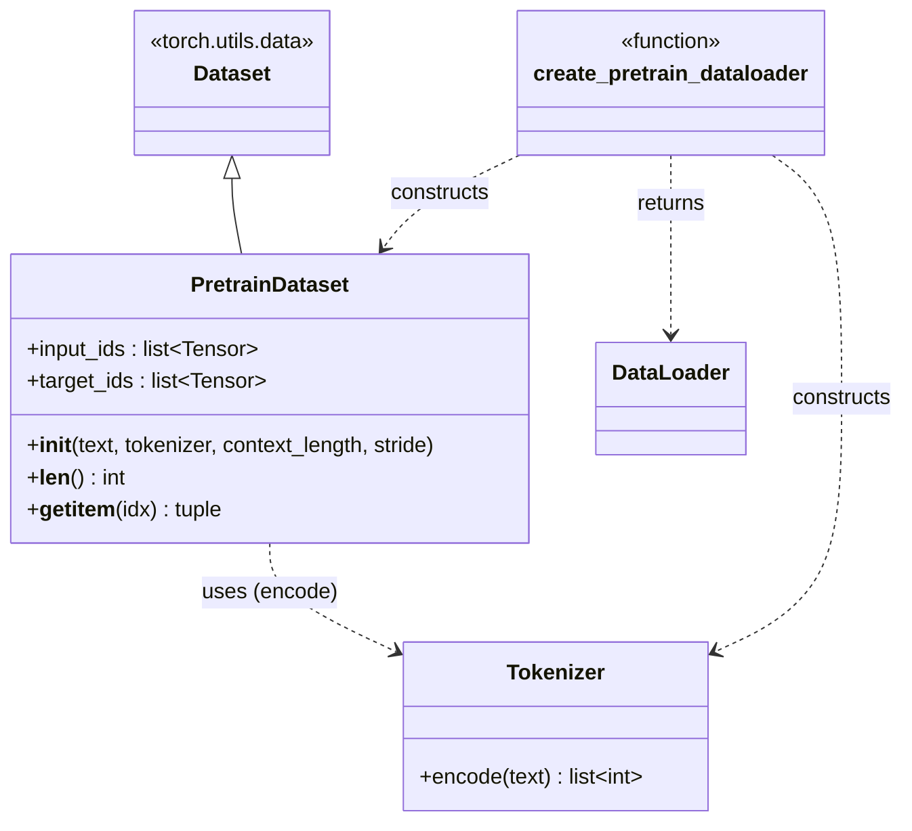

# dataset/

Sliding-window next-token dataset + dataloader for pretraining on raw text.

## Class diagram



## `pretrain_dataset.py`

### `class PretrainDataset(Dataset)`

Whole-corpus sliding-window sampler: builds every `(input, target)` window pair
eagerly in `__init__` and holds all of them in memory as a `list[Tensor]` — fine
for corpus sizes used here (single text files), would need a lazy/streaming
rewrite for a dataset too large to tokenize and hold in RAM at once.

- `__init__(text: str, tokenizer: Tokenizer, context_length: int, stride: int)`
  Input: raw text string, tokenizer instance, window size, step size.
  Tokenizes whole text once, then for `i` in `range(0, len(token_ids) - context_length, stride)`
  appends `token_ids[i : i+context_length]` to `input_ids` and
  `token_ids[i+1 : i+context_length+1]` to `target_ids` (i.e. `target_ids[k] == input_ids[k]` shifted left by one position — the next-token label).
  `stride < context_length` -> overlapping windows (more samples, more correlated);
  `stride == context_length` -> non-overlapping (fewer, independent samples).
  If `len(token_ids) <= context_length`, produces zero windows.
- `__len__() -> int` — number of windows, `len(self.input_ids)`.
- `__getitem__(idx) -> tuple[Tensor, Tensor]` — `(input_ids, target_ids)`, each shape `[context_length]`, dtype `int64`.

## `dataloader.py`

### `create_pretrain_dataloader(text, context_length, batch_size=4, stride=None, shuffle=True, drop_last=True, num_workers=0) -> DataLoader`

Input: raw text, window size, batch params.
Builds a fresh `Tokenizer()` + `PretrainDataset` internally (`stride` defaults to
`context_length` — non-overlapping windows), wraps in `torch.utils.data.DataLoader`.
`drop_last=True` by default so every yielded batch has exactly `batch_size` rows
(important since `GPTModel.pos_emb` is only ever indexed up to `context_length`,
not batch-size-dependent, but keeps loss averaging simple).
Output: `DataLoader` yielding `(input_batch, target_batch)` each `[batch_size, context_length]`.

## Test

```bash
PYTHONPATH=. python -c "
from loom.dataset.dataloader import create_pretrain_dataloader
text = 'the quick brown fox jumps over the lazy dog ' * 50
dl = create_pretrain_dataloader(text, context_length=8, batch_size=2, stride=4)
x, y = next(iter(dl))
print(x.shape, y.shape)
"
```

Expect: `torch.Size([2, 8]) torch.Size([2, 8])`, `y` = `x` shifted by one token.
