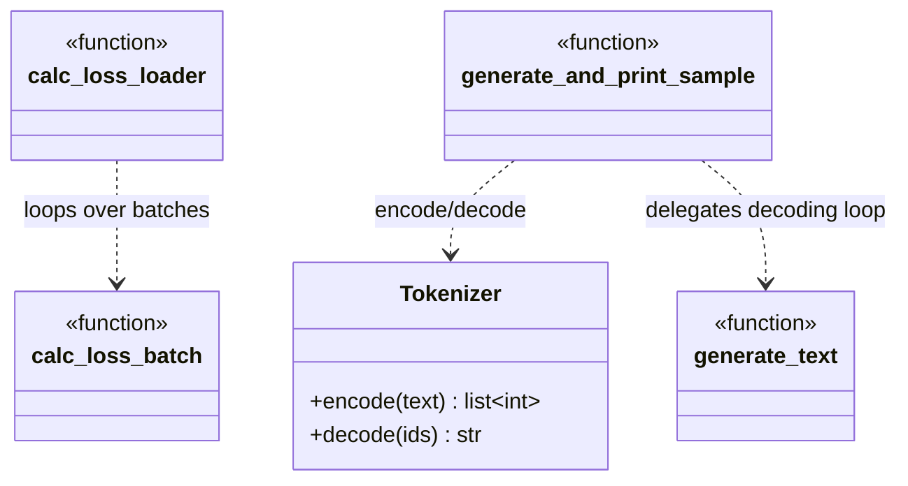

# eval/

Loss calc, generation, and text-sample eval helpers used during pretraining.

## Call diagram



Used by `loom/train/pretrain.py` (`calc_loss_batch`, `calc_loss_loader`,
`generate_and_print_sample`) and `scripts/run_eval.py` (`generate_text` directly).

## `metrics.py`

### `calc_loss_batch(input_batch, target_batch, model, device) -> Tensor` (scalar)
Input: `(input_ids, target_ids)` each `[batch, seq_len]`. Moves to device, runs model,
cross-entropy over flattened logits/targets. Output: scalar loss tensor.

### `calc_loss_loader(data_loader, model, device, num_batches: int | None = None) -> float`
Input: dataloader of `(input_ids, target_ids)`. Averages `calc_loss_batch` over
`num_batches` (or all batches). Output: `float("nan")` if loader empty, else mean loss.

### `generate_text(model, idx, max_new_tokens: int, context_length: int, temperature: float = 0.0, top_k: int | None = None) -> LongTensor[b, seq_len + max_new_tokens]`
Input: `idx` starting token ids `[b, seq_len]`. Autoregressively appends `max_new_tokens`.
`temperature=0.0` -> greedy argmax; `>0` -> softmax + multinomial sample.
`top_k` -> restrict sampling to top-k logits (mask everything below the k-th largest
to `-inf`) before softmax; only applied when not `None`. `idx_cond = idx[:, -context_length:]`
each step so sequences longer than `context_length` are truncated from the left before
the forward pass, keeping `pos_emb` lookups in range. Decorated `@torch.no_grad()`.
Output: extended token ids, shape `[b, seq_len + max_new_tokens]`.

### `generate_and_print_sample(model, device, start_context: str, context_length: int) -> None`
Input: seed text string. Encodes, calls `generate_text` (30 new tokens, greedy),
decodes, prints. Toggles model `eval()`/`train()` around the call. No return value.

## Test

```bash
PYTHONPATH=. python -c "
import torch
from config import GPT_CONFIG_124M
from loom.model.gpt import GPTModel
from loom.eval.metrics import calc_loss_batch, generate_text, generate_and_print_sample

model = GPTModel(GPT_CONFIG_124M)
x = torch.randint(0, GPT_CONFIG_124M.vocab_size, (2, 8))
y = torch.randint(0, GPT_CONFIG_124M.vocab_size, (2, 8))
print('loss', calc_loss_batch(x, y, model, 'cpu').item())

out = generate_text(model, x[:, :4], max_new_tokens=5, context_length=GPT_CONFIG_124M.context_length)
print('generated shape', out.shape)

generate_and_print_sample(model, 'cpu', 'Once upon a time', GPT_CONFIG_124M.context_length)
"
```

Expect: scalar loss, `generated shape torch.Size([2, 9])`, a (gibberish, untrained) printed sample.
