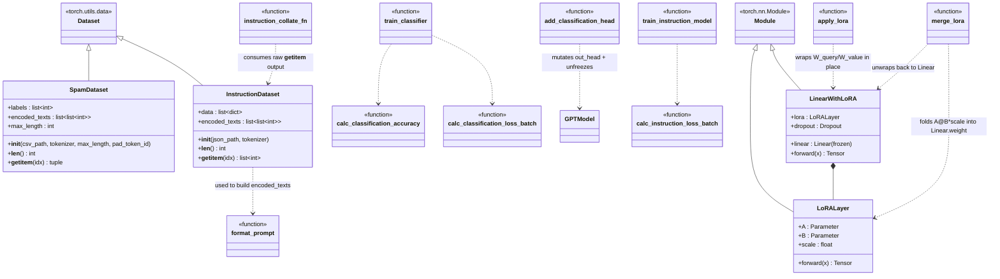

# finetune/

Classification fine-tuning, instruction fine-tuning (Alpaca format), and LoRA adapters.

## Class diagram



## `classifier.py`

### `class SpamDataset(Dataset)`
- `__init__(csv_path: str, tokenizer: Tokenizer, max_length: int, pad_token_id: int = 50256)`
  Input: TSV path with `label`(`ham`/`spam`) + `text` columns, no header. Tokenizes
  each text, pads/truncates to `max_length` (or longest example if `max_length` falsy).
- `__len__() -> int`
- `__getitem__(idx) -> tuple[LongTensor[max_length], LongTensor[]]` — `(token_ids, label)`, label 0=ham/1=spam.

### `add_classification_head(model, emb_dim: int, num_classes: int = 2) -> GPTModel`
Input: pretrained `GPTModel`. Freezes all params, replaces `out_head` with
`Linear(emb_dim, num_classes)`, unfreezes last transformer block + final norm + new head.
Output: same model object, mutated in place.

### `calc_classification_accuracy(data_loader, model, device, num_batches=None) -> float`
Input: dataloader of `(input_ids, label)`. Uses logits at last token position.
Output: accuracy in `[0, 1]`.

### `calc_classification_loss_batch(input_batch, target_batch, model, device) -> Tensor` (scalar)
Cross-entropy on last-token logits vs label.

### `train_classifier(model, train_loader, val_loader, optimizer, device, num_epochs: int) -> GPTModel`
Runs training loop, prints train/val accuracy each epoch (10-batch estimate). Returns model.

## `instruction.py`

### `format_prompt(example: dict) -> str`
Input: dict with `instruction`, optional `input`. Output: Alpaca-template prompt string
ending right before the expected response.

### `class InstructionDataset(Dataset)`
- `__init__(json_path: str, tokenizer: Tokenizer)` — loads Alpaca-format JSON list of
  `{instruction, input, output}`, tokenizes `format_prompt(example) + output` per example.
- `__len__() -> int`
- `__getitem__(idx) -> list[int]` — full tokenized prompt+response (variable length, unpadded).

### `instruction_collate_fn(batch, pad_token_id=50256, ignore_index=-100, max_length=None) -> tuple[LongTensor, LongTensor]`
Input: list of variable-length token-id lists (raw `__getitem__` outputs).
Pads to batch max (or `max_length`), builds `input_ids` / `target_ids` (shifted by 1),
masks target padding beyond the first pad token with `ignore_index` so loss ignores it.
Output: `(input_ids, target_ids)` each `[batch, seq_len]`. Pass as `collate_fn=` to `DataLoader`.

### `calc_instruction_loss_batch(input_batch, target_batch, model, device) -> Tensor` (scalar)
Cross-entropy over all positions, ignoring `ignore_index=-100` targets.

### `train_instruction_model(model, train_loader, val_loader, optimizer, device, num_epochs: int) -> GPTModel`
Training loop, prints avg train/val loss per epoch. Returns model.

## `lora.py`

### `class LoRALayer(in_dim, out_dim, rank, alpha)`
Low-rank `delta_W = (alpha/rank) * A @ B`, `B` zero-initialized so delta starts at 0
(training starts identical to the frozen base layer, then diverges).
`A: Parameter[in_dim, rank]` init `~N(0, 1/sqrt(in_dim))`, `B: Parameter[rank, out_dim]`
init zeros. `rank` controls param count/expressiveness tradeoff; `alpha` scales the
update magnitude independent of `rank` (`scale = alpha / rank`).
- `forward(x: Tensor[..., in_dim]) -> Tensor[..., out_dim]` = `scale * (x @ A @ B)`

### `class LinearWithLoRA(linear: nn.Linear, rank, alpha, dropout=0.0)`
Wraps a frozen `nn.Linear`, adds parallel LoRA path.
- `forward(x: Tensor[..., in_features]) -> Tensor[..., out_features]` = `linear(x) + lora(dropout(x))`

### `apply_lora(model, cfg: LoRAConfig) -> GPTModel`
Input: `GPTModel`, `LoRAConfig` (rank, alpha, dropout, `target_modules` e.g.
`("W_query", "W_value")`). Freezes all params, wraps named attention projections in
each `TransformerBlock` with `LinearWithLoRA`. Output: same model, mutated in place.

### `merge_lora(model) -> GPTModel`
Folds trained LoRA deltas into base `nn.Linear` weights, unwraps `LinearWithLoRA` back
to plain `nn.Linear` so `state_dict` keys match vanilla `GPTModel` (needed before export).
Output: same model, mutated in place.

## Test

Classifier head + LoRA smoke test (no real data needed):

```bash
PYTHONPATH=. python -c "
import torch
from config import GPT_CONFIG_124M, LoRAConfig
from loom.model.gpt import GPTModel
from loom.finetune.classifier import add_classification_head, calc_classification_loss_batch
from loom.finetune.lora import apply_lora, merge_lora

model = GPTModel(GPT_CONFIG_124M)
add_classification_head(model, emb_dim=GPT_CONFIG_124M.emb_dim, num_classes=2)
x = torch.randint(0, GPT_CONFIG_124M.vocab_size, (2, 10))
y = torch.tensor([0, 1])
loss = calc_classification_loss_batch(x, y, model, 'cpu')
print('cls loss', loss.item())

model2 = GPTModel(GPT_CONFIG_124M)
apply_lora(model2, LoRAConfig())
out = model2(x)
print('lora out', out.shape)
merge_lora(model2)
out2 = model2(x)
print('merged out', out2.shape)
"
```

Expect: scalar loss printed, `lora out torch.Size([2, 10, 50257])`, same shape after merge,
no key errors (merge restores plain `nn.Linear` layers).

For `InstructionDataset`/`instruction_collate_fn`, needs a small Alpaca JSON file
(list of `{"instruction":..., "input":"", "output":...}`) — point `json_path` at it and
check `instruction_collate_fn` output shapes match across a batch.
