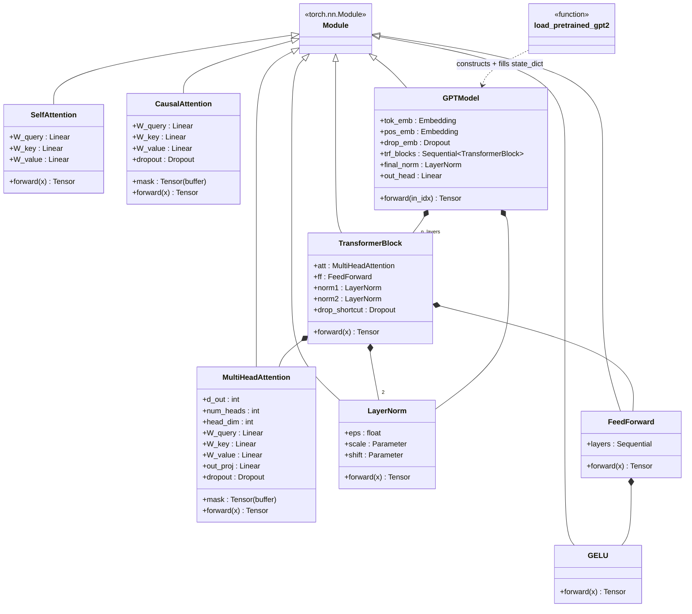

# model/

GPT-2-style decoder-only transformer, built incrementally: attention primitives ->
transformer block -> full model. Plus loader for real GPT-2 pretrained weights.

## Class diagram



## `attention.py`

### `class SelfAttention(d_in, d_out, qkv_bias=False)`
Plain scaled dot-product attention, no causal mask, bidirectional (every position
attends to every other). Not used by `GPTModel` — kept as the first building block
to isolate QKV projection + softmax mechanics.
- Attributes: `W_query`, `W_key`, `W_value` — each `nn.Linear(d_in, d_out, bias=qkv_bias)`.
- `forward(x: Tensor[b, n, d_in]) -> Tensor[b, n, d_out]` — computes
  `softmax(Q K^T / sqrt(d_out)) V`.

### `class CausalAttention(d_in, d_out, context_length, dropout, qkv_bias=False)`
Adds a triangular causal mask (registered buffer `mask`, shape
`[context_length, context_length]`, upper-triangular bool) on top of `SelfAttention`'s
mechanics — token `i` can only attend to tokens `<= i`. Adds `dropout` on attention
weights after softmax.
- `forward(x: Tensor[b, n, d_in]) -> Tensor[b, n, d_out]` — `n` must be `<= context_length`
  or the mask slice `mask[:n, :n]` will still work, but position embeddings elsewhere
  in the model impose the real ceiling.

### `class MultiHeadAttention(d_in, d_out, context_length, dropout, num_heads, qkv_bias=False)`
Splits QKV into `num_heads` heads (`head_dim = d_out // num_heads`, asserted evenly
divisible) after one fused `Linear(d_in, d_out)` projection per Q/K/V — matches
GPT-2's own checkpoint weight shape, required for `pretrained.py` to load without
reshaping. Adds `out_proj: Linear(d_out, d_out)` after recombining heads. Used by
`TransformerBlock`.
- `forward(x: Tensor[b, n, d_in]) -> Tensor[b, n, d_out]`

## `transformer_block.py`

### `class LayerNorm(emb_dim, eps=1e-5)`
Custom LN with `scale`/`shift` params (names match GPT-2 checkpoint keys).
- `forward(x: Tensor[..., emb_dim]) -> Tensor[..., emb_dim]`

### `class GELU()`
Tanh-approx GELU, matches GPT-2 exactly (not `torch.nn.GELU`).
- `forward(x: Tensor) -> Tensor` (elementwise)

### `class FeedForward(cfg: GPTConfig)`
`emb_dim -> 4*emb_dim -> GELU -> emb_dim`.
- `forward(x: Tensor[b, n, emb_dim]) -> Tensor[b, n, emb_dim]`

### `class TransformerBlock(cfg: GPTConfig)`
Pre-norm block: `norm1 -> attn -> +residual`, `norm2 -> ffn -> +residual`.
- `forward(x: Tensor[b, n, emb_dim]) -> Tensor[b, n, emb_dim]`

## `gpt.py`

### `class GPTModel(cfg: GPTConfig)`
Token emb + learned pos emb -> N `TransformerBlock`s -> final norm -> linear head.
- `forward(in_idx: LongTensor[b, seq_len]) -> Tensor[b, seq_len, vocab_size]` (logits)

## `pretrained.py`

### `load_pretrained_gpt2(cfg: GPTConfig, model_name: str = "gpt2-small (124M)") -> GPTModel`
Input: `cfg` (must use `context_length=1024`, `qkv_bias=True`, e.g.
`GPT_CONFIG_124M_PRETRAINED`), model name in `{"gpt2-small (124M)", "gpt2-medium (355M)"}`.
Downloads HF `GPT2Model`, splits fused `c_attn` QKV weight, transposes `Conv1D`-shaped
weights into `nn.Linear` shape, copies into a fresh `GPTModel`, ties `out_head` to `tok_emb`.
Output: `GPTModel` with pretrained weights loaded (`load_state_dict` strict).

## Test

```bash
PYTHONPATH=. python -c "
import torch
from config import GPT_CONFIG_124M
from loom.model.gpt import GPTModel

model = GPTModel(GPT_CONFIG_124M)
x = torch.randint(0, GPT_CONFIG_124M.vocab_size, (2, 16))
logits = model(x)
print(logits.shape)
"
```

Expect: `torch.Size([2, 16, 50257])`.

For attention primitives standalone:

```bash
PYTHONPATH=. python -c "
import torch
from loom.model.attention import SelfAttention, CausalAttention, MultiHeadAttention

x = torch.randn(2, 5, 16)
print(SelfAttention(16, 16)(x).shape)
print(CausalAttention(16, 16, context_length=5, dropout=0.0)(x).shape)
print(MultiHeadAttention(16, 16, context_length=5, dropout=0.0, num_heads=4)(x).shape)
"
```

Expect: all `torch.Size([2, 5, 16])`.

For pretrained loading (downloads weights, needs network):

```bash
PYTHONPATH=. python -c "
from config import GPT_CONFIG_124M_PRETRAINED
from loom.model.pretrained import load_pretrained_gpt2

model = load_pretrained_gpt2(GPT_CONFIG_124M_PRETRAINED)
print(sum(p.numel() for p in model.parameters()))
"
```

Expect: param count ~124M (124439808 minus tied embedding double count nuance).
