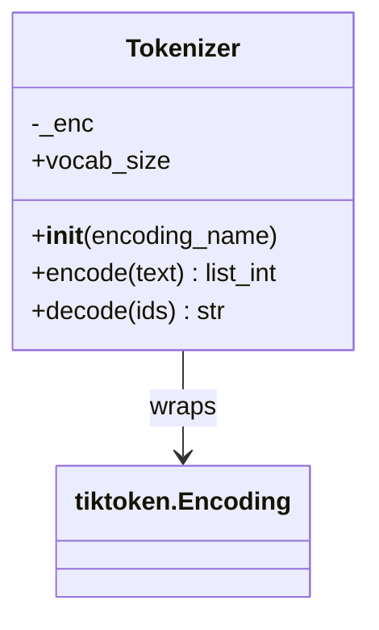

# tokenizer/

Thin wrapper over `tiktoken`'s GPT-2 BPE encoding.

## Class diagram



## `__init__.py`

### `class Tokenizer`

Consumed by every `Dataset` in `dataset/` and `finetune/` — the single point of
text <-> token-id conversion for the whole repo.

- `__init__(encoding_name: str = "gpt2")` — loads a `tiktoken` encoding. Stored as
  private `_enc`; no other state.
- `encode(text: str) -> list[int]` — text to token id list. Allows `<|endoftext|>`
  special token (raises `ValueError` from `tiktoken` if that literal string appears
  in input and isn't in `allowed_special`, hence the explicit allow-list).
- `decode(ids: list[int]) -> str` — token id list back to text. No bounds checking —
  an out-of-vocab id raises inside `tiktoken`.
- `vocab_size` (property) -> `int` — size of vocab (50257 for gpt2 encoding). Used
  to size `nn.Embedding`/`nn.Linear` in `config.py`'s `GPTConfig.vocab_size`.

## Test

```bash
PYTHONPATH=. python -c "
from loom.tokenizer import Tokenizer
t = Tokenizer()
ids = t.encode('Hello world<|endoftext|>')
print(ids)
print(t.decode(ids))
print(t.vocab_size)
"
```

Expect: list of ints in, matching string out, `vocab_size == 50257`.
