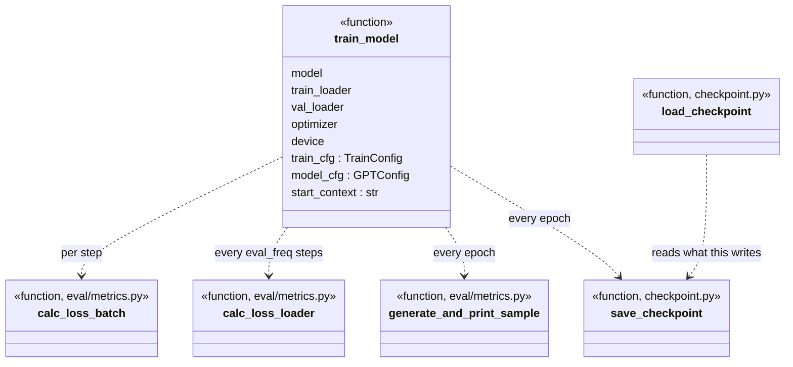

# train/

From-scratch pretraining loop + checkpoint save/load.

## Class / flow diagram



## `pretrain.py`

### `train_model(model, train_loader, val_loader, optimizer, device, train_cfg: TrainConfig, model_cfg: GPTConfig, start_context: str = "Every effort moves you") -> tuple[list[float], list[float], list[int]]`

Input: `GPTModel`, train/val `DataLoader`s (yield `(input_ids, target_ids)` batches),
optimizer, device string, train/model configs, seed text for sample generation.
Per step: forward -> cross-entropy loss -> backward -> grad-clip -> optimizer step.
Every `eval_freq` steps: logs train/val loss over `eval_iter` batches. Every epoch:
prints a generated sample continuing `start_context`, saves a checkpoint to
`train_cfg.checkpoint_dir`.
Output: `(train_losses, val_losses, track_tokens_seen)` — parallel lists for plotting.
No return of the trained model — it's mutated in place (`model.train()`/`model.eval()`
toggled internally, ends in `train()` mode). `global_step` starts at `-1` so the very
first optimizer step (`global_step == 0` after increment) always triggers an eval log.

## `checkpoint.py`

### `save_checkpoint(model, optimizer, epoch: int, global_step: int, checkpoint_dir: str, name: str = "checkpoint.pt") -> str`
Input: model/optimizer, current epoch/step, target dir/filename.
Saves dict with `model_state_dict`, `optimizer_state_dict`, `epoch`, `global_step`.
Creates `checkpoint_dir` if missing (`os.makedirs(..., exist_ok=True)`).
Output: full path written to (`checkpoint_dir/name`).

### `load_checkpoint(model, optimizer, path: str, device: str = "cuda") -> tuple[int, int]`
Input: model/optimizer to load into (in place, via `load_state_dict` — architectures
must match exactly, no partial/strict=False loading), checkpoint path, device to map
tensors to (`torch.load(..., map_location=device)`).
Output: `(epoch, global_step)` from the saved checkpoint.

## Test

```bash
PYTHONPATH=. python -c "
import torch
from config import GPT_CONFIG_124M, TrainConfig
from loom.model.gpt import GPTModel
from loom.dataset.dataloader import create_pretrain_dataloader
from loom.train.pretrain import train_model
from loom.train.checkpoint import save_checkpoint, load_checkpoint

cfg = GPT_CONFIG_124M
train_cfg = TrainConfig(num_epochs=1, eval_freq=2, eval_iter=1, checkpoint_dir='/tmp/loom_ckpt_test')
text = 'the quick brown fox jumps over the lazy dog ' * 200
dl = create_pretrain_dataloader(text, context_length=cfg.context_length, batch_size=2)

model = GPTModel(cfg)
optimizer = torch.optim.AdamW(model.parameters(), lr=train_cfg.learning_rate)
train_model(model, dl, dl, optimizer, 'cpu', train_cfg, cfg)

path = save_checkpoint(model, optimizer, epoch=0, global_step=1, checkpoint_dir='/tmp/loom_ckpt_test')
epoch, step = load_checkpoint(model, optimizer, path, device='cpu')
print(epoch, step)
"
```

Expect: training log lines print, loads back `(0, 1)` with no errors.
