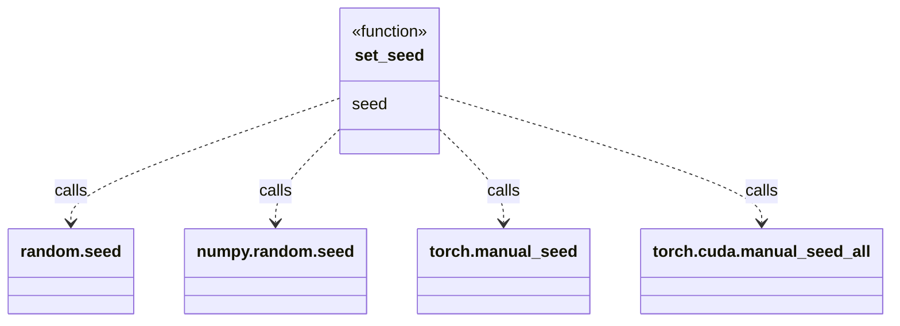

# utils/

Small shared helpers.

## Diagram



No classes in this module — a single function, no shared state (each call reseeds
all three RNG backends independently; there's no `Random`/`Generator` object held).

## `seed.py`

### `set_seed(seed: int = 123) -> None`
Input: int seed. Sets `random.seed`, `numpy.random.seed`, `torch.manual_seed`,
`torch.cuda.manual_seed_all` — call once at the top of any script needing
reproducible dataloader shuffling / weight init / sampling. `torch.cuda.manual_seed_all`
is a no-op (safe) if no CUDA device is available. No return value, no side effects
beyond global RNG state.

## Test

```bash
PYTHONPATH=. python -c "
import torch
from loom.utils.seed import set_seed

set_seed(42)
a = torch.randn(3)
set_seed(42)
b = torch.randn(3)
print(torch.equal(a, b))
"
```

Expect: `True` (same seed -> identical random tensor).
