# scripts/

CLI wrappers around `loom/*` library code, plus a few one-off (`_`-prefixed) scratch
scripts used during development. Run all from repo root with `PYTHONPATH=.` and
`.venv` active.

## Dependency diagram

```mermaid
classDiagram
    class run_pretrain {
        <<script>>
        run(corpus_path, checkpoint_dir, num_epochs, eval_freq, eval_iter, batch_size, lr, val_split, seed)
    }
    class run_finetune_classifier {
        <<script>>
        run(data_path, checkpoint_dir, num_epochs, batch_size, lr, max_length, seed)
    }
    class run_finetune_instruction {
        <<script>>
        run(data_path, checkpoint_dir, num_epochs, batch_size, lr, max_length)
    }
    class run_lora {
        <<script>>
        run(data_path, checkpoint_dir, num_epochs, batch_size, lr, max_length, rank, alpha)
    }
    class run_eval {
        <<script>>
        run(checkpoint_path, max_new_tokens)
    }
    class SaveVanillaGpt2["_save_vanilla_gpt2"] {
        <<scratch script, no args>>
    }
    class TrainLoraInstruct["_train_lora_instruct"] {
        <<scratch script, no args>>
    }
    class VerifyHubReload["_verify_hub_reload"] {
        <<scratch script, no args>>
    }

    class GPTModel["loom.model.gpt.GPTModel"]
    class TrainModelFn["loom.train.pretrain.train_model"]
    class CreatePretrainDL["loom.dataset.dataloader.create_pretrain_dataloader"]
    class LoadPretrainedGpt2["loom.model.pretrained.load_pretrained_gpt2"]
    class SpamDataset["loom.finetune.classifier.SpamDataset"]
    class AddClsHead["loom.finetune.classifier.add_classification_head"]
    class TrainClassifier["loom.finetune.classifier.train_classifier"]
    class InstructionDataset["loom.finetune.instruction.InstructionDataset"]
    class TrainInstructionModel["loom.finetune.instruction.train_instruction_model"]
    class ApplyLora["loom.finetune.lora.apply_lora"]
    class MergeLora["loom.finetune.lora.merge_lora"]
    class GenerateText["loom.eval.metrics.generate_text"]
    class LoadCheckpoint["loom.train.checkpoint.load_checkpoint"]
    class SaveCheckpoint["loom.train.checkpoint.save_checkpoint"]
    class AutoModelForCausalLM["transformers.AutoModelForCausalLM"]

    run_pretrain ..> GPTModel : from scratch
    run_pretrain ..> TrainModelFn
    run_pretrain ..> CreatePretrainDL

    run_finetune_classifier ..> LoadPretrainedGpt2
    run_finetune_classifier ..> SpamDataset
    run_finetune_classifier ..> AddClsHead
    run_finetune_classifier ..> TrainClassifier

    run_finetune_instruction ..> LoadPretrainedGpt2
    run_finetune_instruction ..> InstructionDataset
    run_finetune_instruction ..> TrainInstructionModel

    run_lora ..> LoadPretrainedGpt2
    run_lora ..> InstructionDataset
    run_lora ..> ApplyLora
    run_lora ..> MergeLora
    TrainLoraInstruct ..> ApplyLora : hardcoded dev twin of run_lora

    run_eval ..> LoadPretrainedGpt2
    run_eval ..> GenerateText
    run_eval ..> LoadCheckpoint

    SaveVanillaGpt2 ..> LoadPretrainedGpt2
    SaveVanillaGpt2 ..> SaveCheckpoint

    VerifyHubReload ..> AutoModelForCausalLM : loads pushed HF Hub model
```



All `run_*.py` scripts save via `loom.train.checkpoint.save_checkpoint` and expose an
`argparse` CLI over their `run(...)` function — call `run()` directly from Python for
programmatic use (e.g. notebooks) instead of shelling out.

## `run_pretrain.py`

From-scratch pretraining on a raw text corpus.

### `run(corpus_path, checkpoint_dir, num_epochs, eval_freq, eval_iter, batch_size, lr, val_split, seed) -> None`
Reads corpus file, splits train/val by `val_split`, builds `GPT_CONFIG_124M` model +
dataloaders, trains via `loom.train.pretrain.train_model`, checkpoints each epoch.

Test:
```bash
PYTHONPATH=. python scripts/run_pretrain.py \
  --corpus data/raw/the-verdict.txt --num-epochs 1 --eval-freq 5 --eval-iter 2 \
  --checkpoint-dir /tmp/loom_pretrain_test
```
Expect: loss log lines, a generated sample line, checkpoint written under `/tmp/loom_pretrain_test`.

## `run_finetune_classifier.py`

Spam/ham classification fine-tune on top of pretrained GPT-2.

### `run(data_path, checkpoint_dir, num_epochs, batch_size, lr, max_length, seed) -> None`
Balances spam/ham classes, 80/20 train/val split (temp TSV files), loads
`GPT_CONFIG_124M_PRETRAINED` GPT-2, adds classification head, trains, saves checkpoint.

Test:
```bash
PYTHONPATH=. python scripts/run_finetune_classifier.py \
  --data data/raw/sms_spam/SMSSpamCollection --num-epochs 1 \
  --checkpoint-dir /tmp/loom_cls_test
```
Expect: `epoch 1: train acc ..., val acc ...` line, then `saved: /tmp/loom_cls_test/checkpoint.pt`.

## `run_finetune_instruction.py`

Alpaca-format instruction fine-tune (full model, no LoRA).

### `run(data_path, checkpoint_dir, num_epochs, batch_size, lr, max_length) -> None`
85/10/5 train/val/(unused) split of `InstructionDataset`, loads pretrained GPT-2,
trains via `train_instruction_model`, saves checkpoint.

Test:
```bash
PYTHONPATH=. python scripts/run_finetune_instruction.py \
  --data data/raw/instruction/instruction-data.json --num-epochs 1 \
  --checkpoint-dir /tmp/loom_instruct_test
```
Expect: `epoch 1: train loss ..., val loss ...` line, then `saved: ...`.

## `run_lora.py`

Same as `run_finetune_instruction.py` but LoRA adapters (q/v-proj) instead of full
fine-tune; merges adapters into base weights before saving.

### `run(data_path, checkpoint_dir, num_epochs, batch_size, lr, max_length, rank, alpha) -> None`

Test:
```bash
PYTHONPATH=. python scripts/run_lora.py \
  --data data/raw/instruction/instruction-data.json --num-epochs 1 \
  --checkpoint-dir /tmp/loom_lora_test --rank 8 --alpha 16
```
Expect: `trainable: N / M` line (N << M), training log, `saved: ...`. Checkpoint's
`state_dict` keys should match plain `GPTModel` (LoRA merged, no `LinearWithLoRA` wrappers).

## `run_eval.py`

Side-by-side generation: base pretrained GPT-2 vs a fine-tuned checkpoint, same prompts.

### `run(checkpoint_path: str | None, max_new_tokens: int = 40) -> None`
If `checkpoint_path` is `None`, only prints `[BASE]` outputs.

Test:
```bash
PYTHONPATH=. python scripts/run_eval.py --checkpoint /tmp/loom_instruct_test/checkpoint.pt --max-new-tokens 20
```
Expect: `[BASE] ...` and `[FINE-TUNED] ...` lines per prompt in `SAMPLE_PROMPTS`.

## `_save_vanilla_gpt2.py` (scratch, no args)

Loads unmodified pretrained GPT-2 (124M), saves it as a checkpoint — baseline for
comparison against fine-tuned variants.

Test: `PYTHONPATH=. python scripts/_save_vanilla_gpt2.py` — expect `saved: checkpoints/vanilla_gpt2/checkpoint.pt`.

## `_train_lora_instruct.py` (scratch, no args)

Hardcoded-params version of `run_lora.py` (rank=8, alpha=16, 1 epoch) — used as an
inline dev script before the CLI wrapper existed. Prefer `run_lora.py` for new runs.

Test: `PYTHONPATH=. python scripts/_train_lora_instruct.py` — same expected output as `run_lora.py`.

## `_verify_hub_reload.py` (scratch, no args, needs network + HF Hub model pushed)

Sanity-checks a model pushed to HF Hub (`msclaw/loom-gpt2-124m`) reloads via
`AutoModelForCausalLM` and generates coherent continuation of `"Every effort moves you"`.

Test: `PYTHONPATH=. python scripts/_verify_hub_reload.py` — expect a printed text continuation, no exceptions.
